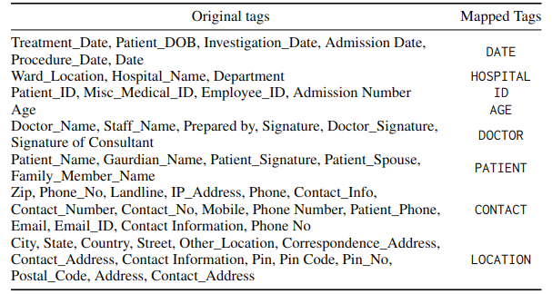

# Preprocessing
We have five datasets: n2c2 2006, n2c2 2014, ICDS-R (real dataset from SGPGI), ICDS-G(l) (Llama-generated discharge summaries), and ICDS-G(g) (Gemini-generated discharge summaries). The Preprocessing folder contains preprocessing scripts for all the datasets.

Each dataset has its own tag set. n2c2-2006 contains 9 tags, n2c2-2014 contains 24, ICDS-R contains 26, ICDS-G(g) contains 34, and ICDS-G(l) contains 106 unique tags, including the OTHERS tag. In the datasets n2c2-2006,n2c2-2014, and ICDS-R, all the tags are related to PHI entities. However, in the ICDS-G(l) and ICDS-G(g) datasets, a few annotated tags are not related to the PHI entities due to LLM hallucinations. To train models for a fair comparison, we need a uniform tag set across all datasets. Hence, we mapped the tag set of all the datasets to the n2c2-2006 tag set. In all the datasets, we mapped entities like street, city, country, zip, etc to LOCATION. Similarly, we mapped phone number, mobile number, email, landline, etc, to CONTACT.Additionally, we mapped all the PHI-related entities to their super-set. In the ICDS-G(l) and ICDS-G(g) datasets, we have several tags unrelated to the PHI entities. Hence, we mapped all non-PHI entities to the OTHERS tag.Below diagram shows the tag mapping from PHI entities in the different datasets to the PHI entity set of n2c2-2006 dataset, and all other non-PHI entities are mapped with Others tag.

Here, We have included a piece of annotated medical text along with the preprocessed medical text using BIO tagging.  
